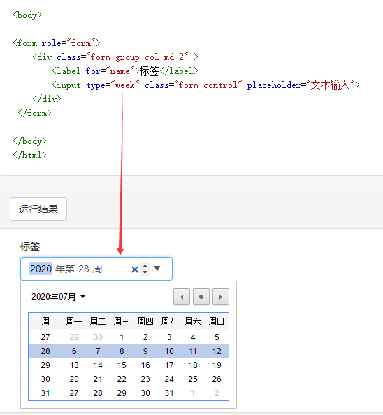
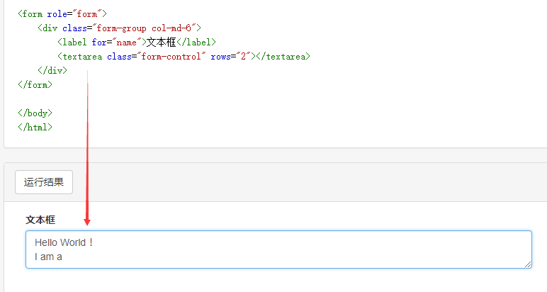

### 表格

* Bootstrap提供了一个清晰的创建表格的布局。下表列出了Bootstrap支持的一些表格元素：

|标签|描述|
|-----|------|
|\<table\>|为表格添加基础样式。|
|\<thead\>|表格标题行的容器元素（\<tr\>），即表头的作用|
|\<tbody\>|表格主体中的表格行的容器元素（\<tr\>）,表中的数据部分|
|\<tr\>|一组出现在单行上的表格单元格的容器元素（\<td\> 或 \<th\>）|
|\<td\>|默认的表格单元格。|
|\<th\>|特殊的表格单元格，用来标识列或行（取决于范围和位置）。必须在\<thead\> 内使用|
|\<caption\>|关于表格存储内容的描述或总结|

* 表格样式类

|类|描述|
|----|-----|
|.table|为任意\<table\>添加基本样式 (只有横向分隔线)|
|.table-striped|在\<tbody\>内添加斑马线形式的条纹( IE8 不支持)|
|.table-bordered|为所有表格的单元格添加边框|
|.table-hover|在\<tbody\>内的任一行启用鼠标悬停状态|
|.table-condensed|让表格更加紧凑|

### 表单 

使用Bootstrap创建表单。Bootstrap通过一些简单的HTML标签和扩展的类即可创建出不同样式的表单。
Bootstrap提供了下列类型的表单布局
* 垂直表单（默认）
* 内联表单
* 水平表单

1 基本的表单结构是Bootstrap自带的，个别的表单控件自动接收一些全局样式。下面列出了创建基本表单的步骤：

* 向父\<form\>元素添加 role="form"。
* 把标签和控件放在一个带有class .form-group 的\<div\>中。这是获取最佳间距所必需的。
* 向所有的文本元素\<input\>、\<textarea\>和\<select\> 添加class ="form-control" 。

~~~html

  1-垂直基本表单的使用:
        <form role="form"> 
            

                <label for="name">名称</label>
                <input type="text" class="form-control" id="name" placeholder="请输入名称">
            

            

                <label for="inputfile">文件输入</label>
                <input type="file" id="inputfile">
                
块级帮助文本的实例 

            

            

                <label>
                <input type="checkbox">请打勾
                </label>
            

            <button type="submit" class="btn btn-default">提交</button>
        </form>

~~~

2 如果需要创建一个表单，所有元素是内联的，向左对齐的标签是并排的。在\<form\>标签添加class .form-inline。

~~~html

 2-内联表单的使用:元素是内联的，向左对齐的，标签是并排的，向&lt;form&gt;标签添加class.form-inline
        <form class="form-inline" role="form"> 
            

                <label class="sr-only" for="name">名称</label>
                <input type="text" class="form-control" id="name" placeholder="请输入名称">
            

            

                <label class="sr-only" for="inputfile">文件输入</label>
                <input type="file" id="inputfile">
            

            

                <label>
                    <input type="checkbox">请打勾
                </label>
            

            <button type="submit" class="btn btn-default">提交</button>
        </form>

~~~
3 水平表单与其他表单不仅标记的数量上不同，而且表单的呈现形式也不同。如需创建一个水平布局的表单，请按下面的几个步骤进行

* 向父\<form\> 元素添加 class .form-horizontal。
* 把标签和控件放在一个带有 class .form-group 的\<div\>中。
* 向标签添加 class .control-label

~~~html

 3-水平表单：水平表单与其他表单不仅标记的数量上不同，而且表单的呈现形式也不同。 
        向父&lt;form&gt;元素添加class.form-horizontal;
        把标签和控件放在一个带有class.form-group的&lt;div&gt;中;
        向标签添加class.control-label
        <form class="form-horizontal" role="form">
            

                <label for="firstname" class="col-sm-2 control-label">名字</label>
                

                <input type="text" class="form-control" id="firstname" placeholder="请输入名字">
                

            

            

                <label for="lastname" class="col-sm-2 control-label">姓</label>
                

                <input type="text" class="form-control" id="lastname" placeholder="请输入姓氏">
                

            

            

                

                

                    <label>
                        <input type="checkbox">请记住我
                    </label>
                

                

            

            

                

                <button type="submit" class="btn btn-default">登录</button>
                

            

        </form>

~~~

### 支持表单的控件

Bootstrap支持最常见的表单控件，主要是input、textarea、checkbox、radio和select。

* 输入框-input

最常见的表单文本字段是输入框input。用户可以在其中输入大多数必要的表单数据。Bootstrap提供了对所有原生的 HTML5的input类型的支持，
包括：text、password、datetime、datetime-local、date、month、time、week、number、email、url、search、tel 和 color。
适当的type声明是必需的，这样能让input获得完整的样式

~~~html
<form role="form">
  

    <label for="name">标签</label>
    <input type="text" class="form-control" placeholder="文本输入">
  

</form>
~~~

* 文本框 - Textarea

需要进行多行输入的时，则可以使用文本框textarea。必要时可以改变rows属性（较少的行=较小的盒子，较多的行=较大的盒子）。

~~~html
<form role="form">
  

    <label for="name">文本框</label>
    <textarea class="form-control" rows="3"></textarea>
  

</form>
~~~

* 复选框-Checkbox和单选框-Radio

复选框和单选按钮用于让用户从一系列预设置的选项中进行选择。
当创建表单时，如果想让用户从列表中选择若干个选项时，使用checkbox。如果限制用户只能选择一个选项，使用radio。
对一系列复选框和单选框使用.checkbox-inline或.radio-inline class，控制它们显示在同一行上

~~~html

    <label><input type="checkbox" value="">选项 1</label>

    <label><input type="checkbox" value="">选项 2</label>

 

    <label for="name">限制用户只能选择一个选项，使用radio。但各radio下的name要保持一样才能达到效果</label>   
    

        <label>
            <input type="radio" name="radio-check" id="input" value="1" checked="checked">
            Radio Box 1
        </label>
    

    

        <label>
            <input type="radio" name="radio-check" id="input" value="2">
            Radio Box 2
        </label>
    

~~~

* 选择框-select

当想让用户从多个选项中进行选择，但是默认情况下只能选择一个选项时，则使用选择框。
使用\<select\>展示列表选项，通常是那些用户很熟悉的选择列表。使用 multiple="multiple" 允许用户选择多个选项

~~~html
<form action="" method="POST" role="form">
           <legend>表单-列表选择</legend>
           

               <label for="">list-列表选择</label>
               <select class="form-control">
                   <option value="1">one</option>
                   <option value="2">two</option>
                   <option value="3">three</option>
                   <option value="4">four</option>
               </select>
                
               <select multiple class="form-control">
                   <option>1</option>
                   <option>2</option>
                   <option>3</option>
                   <option>4</option>
               </select>
           

           <button type="submit" class="btn btn-primary">提交</button>
</form>
~~~

* 静态控件

当需要在一个水平表单内的表单标签后放置纯文本时，在\<p\>上使用class .form-control-static。

~~~html
 <form class="form-horizontal" role="form">
    

        <label class="col-sm-2 control-label">Email</label>
        

        
email@example.com

        

    

</form>
~~~

