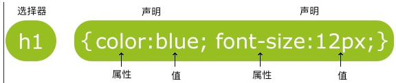

Bootstrap 是一个用于快速开发Web应用程序和网站的前端框架。Bootstrap是基于HTML、CSS、JAVASCRIPT的。

## CSS  

基础语法 - CSS 规则由两个主要的部分构成：选择器，以及一条或多条声明:

选择器通常是您需要改变样式的 HTML 元素。
每条声明由一个属性和一个值组成。
属性（property）是您希望设置的样式属性（style attribute）。每个属性有一个值。属性和值被冒号分开

* CSS声明总是以分号(;)结束，声明总以大括号({})括起来:

~~~html
<!DOCTYPE html>
<html>
<head>
<meta charset="utf-8"> 
<title>菜鸟教程(runoob.com)</title> 

</head>

<body>

Hello World!

这个段落采用CSS样式化。

</body>
</html>
~~~

* id 和 class选择器

id 选择器可以为标有特定 id 的 HTML 元素指定特定的样式。HTML元素以id属性来设置id选择器,CSS 中 id 选择器以 "#" 来定义。
以下的样式规则应用于元素属性 id="para1":

~~~html
<!DOCTYPE html>
<html>
<head>
<meta charset="utf-8"> 
<title>菜鸟教程(runoob.com)</title> 

</head>

<body>

Hello World!

这个段落不受该样式的影响。

</body>
</html>
~~~

class 选择器用于描述一组元素的样式，class 选择器有别于id选择器，class可以在多个元素中使用。class 选择器在HTML中以class属性表示, 在 CSS 中，类选择器以一个点"."号显示：

~~~html
<!DOCTYPE html>
<html>
<head>
<meta charset="utf-8"> 
<title>菜鸟教程(runoob.com)</title> 

</head>

<body>
<h1 class="center">标题居中</h1>

段落居中。
 
</body>
</html
~~~

* 如何使用CSS
	
外部样式表(External style sheet)
当样式需要应用于很多页面时，外部样式表将是理想的选择。在使用外部样式表的情况下，你可以通过改变一个文件来改变整个站点的外观。每个页面使用 <link> 标签链接到样式表。 <link> 标签在（文档的）头部。

~~~html
<head>
<link rel="stylesheet" type="text/css" href="mystyle.css">
</head>
~~~
	
内部样式表(Internal style sheet)
当单个文档需要特殊的样式时，就应该使用内部样式表。你可以使用 
</head>
~~~

内联样式(Inline style)
由于要将表现和内容混杂在一起，内联样式会损失掉样式表的许多优势。请慎用这种方法，例如当样式仅需要在一个元素上应用一次时。
要使用内联样式，你需要在相关的标签内使用样式（style）属性。Style 属性可以包含任何 CSS 属性。本例展示如何改变段落的颜色和左外边距

~~~html

这是一个段落。

~~~	

内联样式）Inline style > （内部样式）Internal style sheet >（外部样式）External style sheet > 浏览器默认样式。

* 伪类

CSS伪类是用来添加一些选择器的特殊效果。

伪类的语法 ： 
selector:pseudo-class {property:value;}

CSS类也可以使用伪类：
selector.class:pseudo-class {property:value;}

